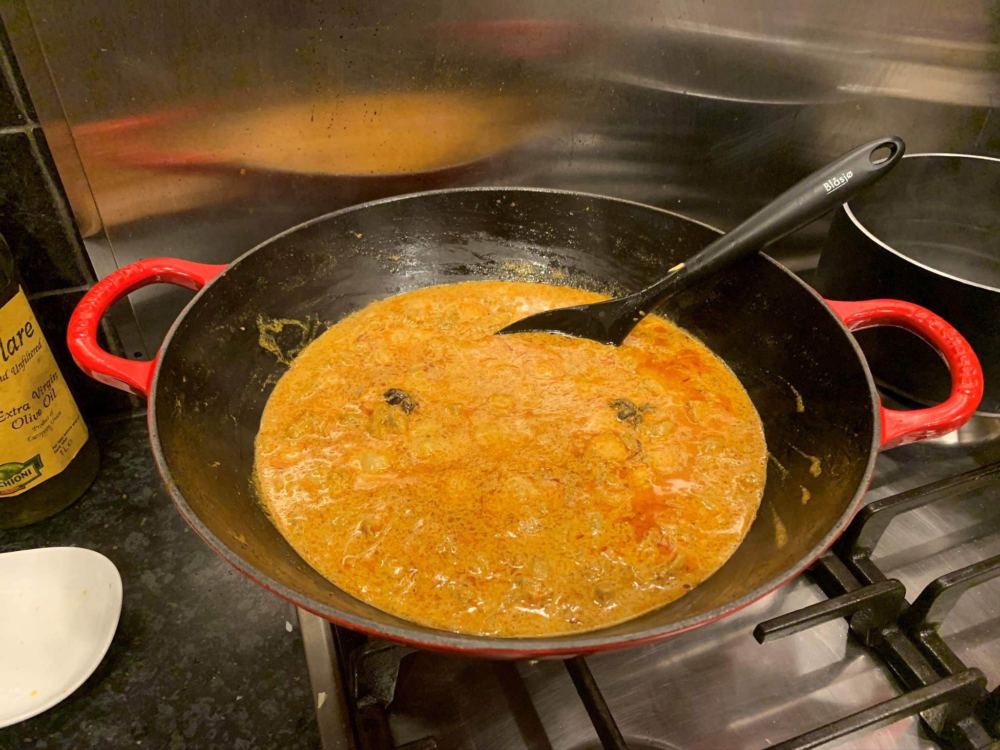

# Lamb Rogan Josh

* Serves: 4
* Prep Time: 2 hours 30 minutes
* Cook Time: 30 minutes

I jump at the opportunity to cook with lamb and while I prefer to have my lamb as unadulterated as possible it makes for a really great curry. 
You can make your lamb rogan josh as hot or as mild as you like but to encourage my daughter to enjoy it I tend to cook it more on the mild side.
Serve with naan bread or popadmoms and condaments such as mango chutney and Tzatziki sauce for example.

## Ingredients:
* 100ml cooking oil 
* 2 large onions, peeled and thinly sliced 
#### Lamb marinade
* 150g natural yogurt 
* Pinch saffron
* 50g ginger-garlic paste
* 1kg diced lamb (leg is best)

#### Crushed spices for the onions
* 1½ tsp cumin seeds 
* 1½ star anise
* 1 tsp black pepper
* 8 cardamom pods
* 8 cloves 
* 2½cm cinnamon stick 

#### Powdered spices for the lamb
* 1 heaped tbsp red chilli powder 
* 1½ tbsp ground coriander
* 1 tsp garam masala
* 1 tsp ground turmeric

#### Garnish to serve
* 1 bunch fresh coriander leaves, finely chopped 
* 3cm piece fresh ginger, peeled and julienned

## Method:
1. Mix together the yogurt, saffron, ginger paste and garlic paste.
2. Add the lamb and season to taste.
3. Cover clingfilm and leave to marinate in the fridge for a few hours. But remember to bring the lamb to room temperature before cooking. 
4. Pound the whole spices with a pestle and mortar to release the oils. 
5. Heat the oil in a heavy-based pan then add the pounded spices and stir until the spices crackle. 
6. Add the finely chopped onions immediately after the spices crackle to stop them from burning.
7. The trick to creating a great Rogan Josh is to cook the onions until they have absorned the spices and they're a deep brown.
8. Stir and cook until the onions are golden brown. 
9. Add the lamb with the marinade to the pan and cook until the meat is browned but not cooked through.
10. It might stick to the pan but don't worry. Keep stirring and scraping the pan to develop the flavours. You can add a splash of water or lamb stock if the mixture becomes too dry.
11. Add all the powdered spices and cook for 5 minutes.
12. Serve garnished with coriander and thin shreds of ginger.

## See also:
- [This is inspired by Michelin-starred chef Atul Kochhar.](https://www.youtube.com/watch?v=NZVo32n7iS8)
