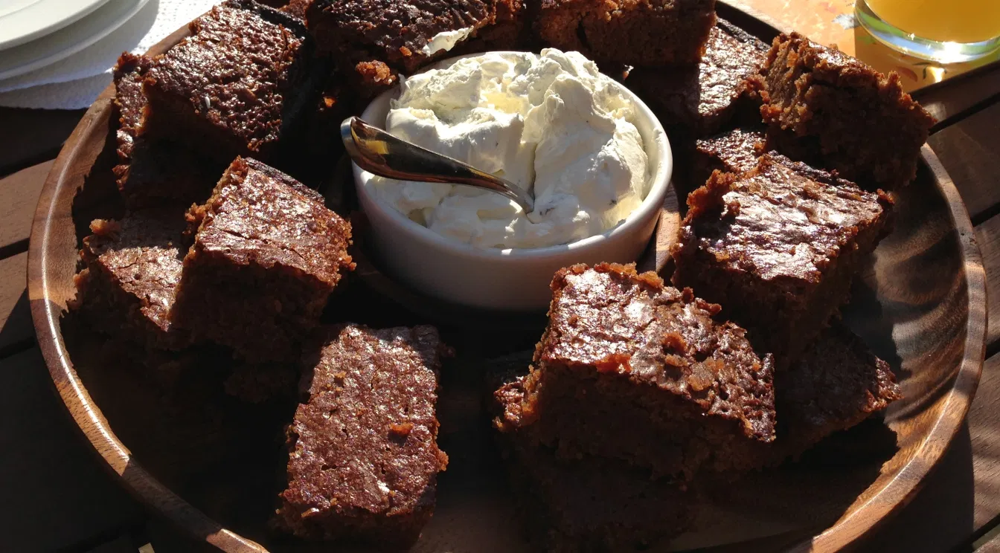
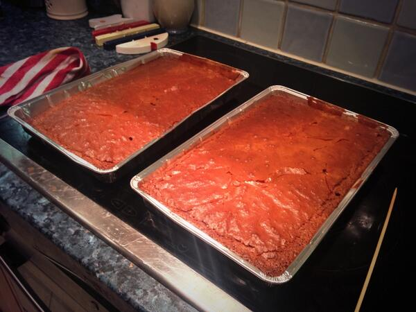

# Mums delicious chocolate brownies

- Serves: 12 servings
- Prep time: 10 min
- Cook time:  45 min
- Total: 55 min

## Ingredients
- 140g unsalted butter softened plus a small amount for lining the baking tin
- 200g quality milk chocolate such as Lindt or Hotel Chocolat
- 200g caster sugar
- Pinch of sea salt
- 2 tsp vanilla extract / vanilla paste
- 2 eggs and 1 egg yolk
- 85g plain flour

## Method
1. Preheat oven to 180°C.
2. Line a brownie tin with a small amount of butter (7″ square tin is most suitable)
3. Melt the butter and chocolate on a slow heat and then allow to cool slightly.
4. Mix in the sugar, a pinch of sea salt and the vanilla extract, stopping once the mixture is a little grainy.
5. Whisk in the eggs and yolk one at a time, stirring each time until blended.
6. Sift in the flour and beat for a minute or so until thickened and smooth.
7. Pour the mixture into the tin and bake for 40-45 minutes or until a cocktail stick comes out with moist crumbs.
8. Allow to cool and cut into small rectangles slices.

## Pictures

## Reference
- [Mums delicious chocolate brownies](https://jcallaghan.com/2012/04/mums-delicious-brownie-recipe/)
