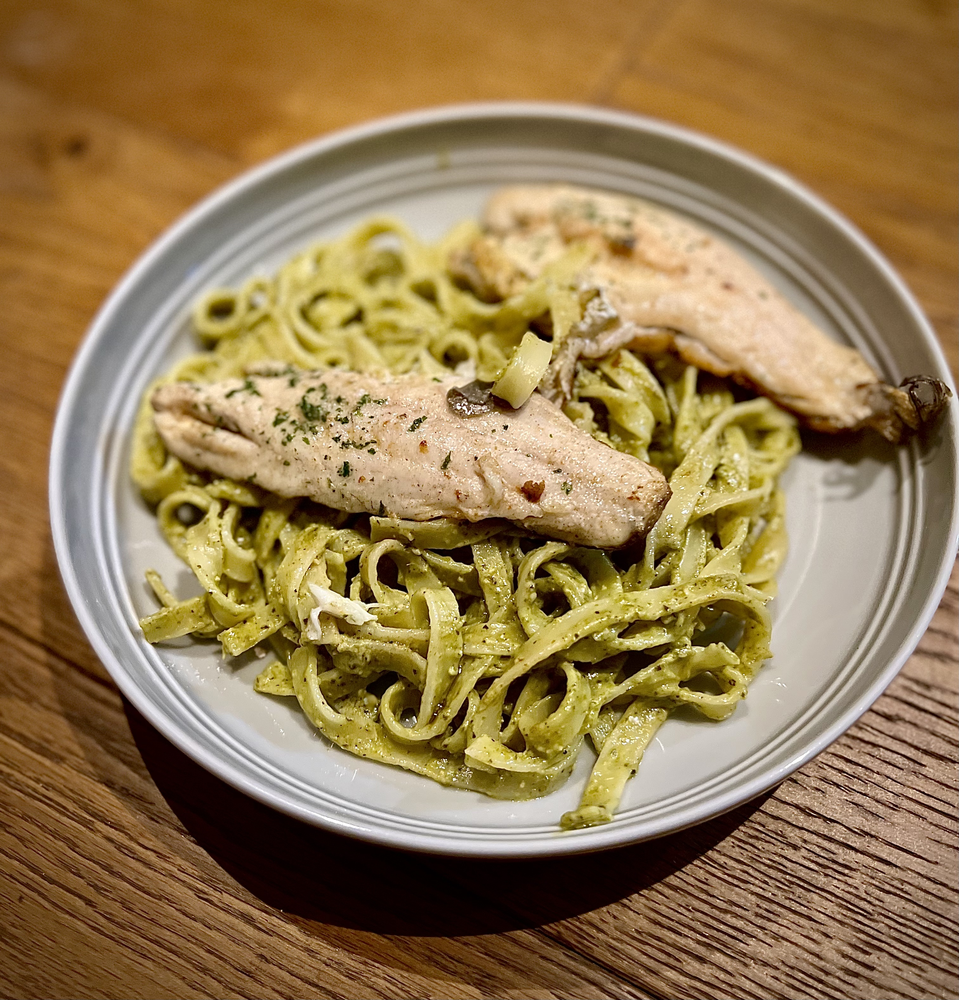

# Pesto tagliatelle with sea bass

- Serves: 2 servings
- Prep time: 0 min
- Cook time:  15 min
- Total: 15 min

## Ingredients
- 2 seabass fillets, butterflied
- 300g tagliatelle pasta
- 4 tbsp green pesto (see #183 for homemade recipe)
- 1 tbsp butter
- 1 tbsp cream
- Seasoning, to taste
- [Optional] Cherry tomatoes on the vine

## Method
1. Bring a pan of water to a boil for the pasta.
2. Add the tagliatelle and cook as per packet instructions (11 minutes).
3. While the pasta is cooking, pan fry the seabass, cooking skin side down on a medium heat.
4. Before the pasta finishes cooking, add the butter to the pan.
5. Tilt the pan and spoon the melted butter over the seabass for a few minutes.
6. Add the tomatoes to the pan.
7. Drain the pasta.
8. Place the pasta back in the pan and mix in the cream and pesto.
9. Serve the pasta in a bowl with the seabass and tomatoes on top.

## Pictures

