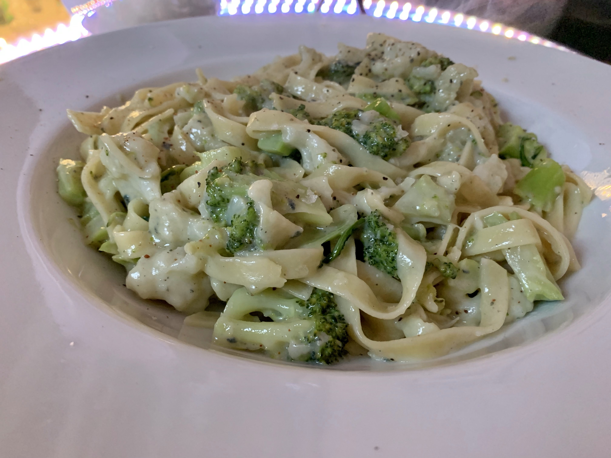

# Tagliatelle with broccoli, cauliflower and blue cheese

- Serves: 2
- Prep Time: 5 minutes
- Cook Time: 15 minutes
- Total 20 minutes

You have to really like your blue cheese for this dish. The blue cheese sauce melted over the small cauliflower florets is wondeful a wonderful, smelly tastey little bite of food.

## Ingredients

- 170g spinach tagliatelle pasta
- 150g broccoli florets
- 150g cauliflower florets
- 200g blue cheese (Cambazola)
- Nutmeg, freshly grated
- Salt and pepper to taste

## Method
1. Cook the pasta (10-12 minutes), until al dente. 
1. While the pasta cooks trim the broccoli and cauliflower florets into bite-sized pieces.
1. Add the florets to the pasta for the last 2-3 minutes.
1. Drain the pasta and vegetables into a colander.
1. Return the dry pan to the hob on a low heat and add the blue cheese.
1. Let the cheese melt, stirring frequently to make a smooth sauce.
1. Once the cheese has melted add the cooked pasta and vegetables.
1. Turn the pasta and mix well and heat through.
1. Season to taste with nutmeg, salt and black pepper.

## Pictures

